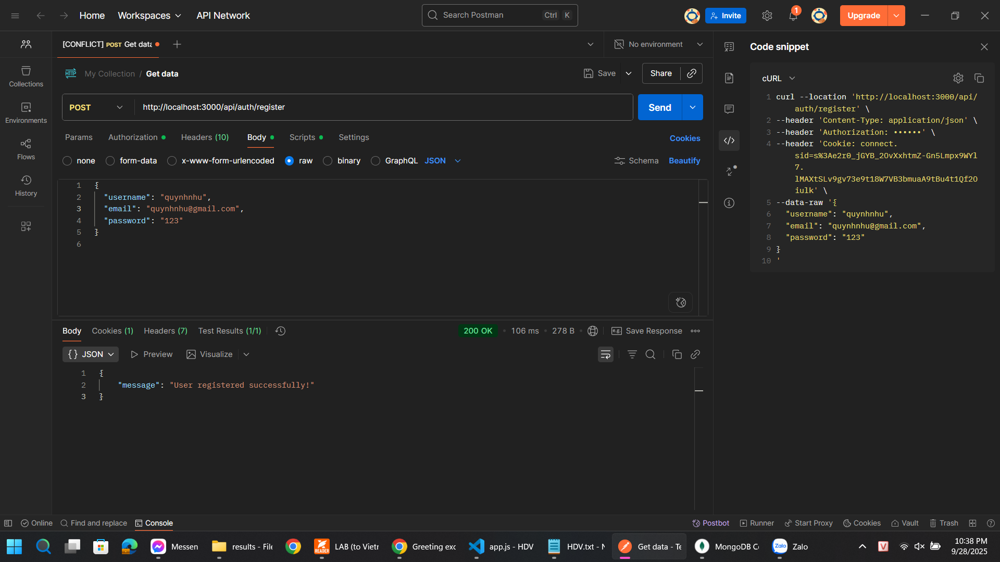

# Token Auth

---

## Cách chạy

```bash
npm install
node app.js
```

Server chạy tại: `http://localhost:3000`

---

## Routes

* `POST /api/auth/register` → Đăng ký
* `POST /api/auth/login` → Đăng nhập
* `GET /api/auth/profile` → Trang cá nhân (yêu cầu Bearer Token)

---

## Cách test với Postman

### 1. Register

**Method**: `POST`
**URL**: `http://localhost:3000/api/auth/register`
**Body** → raw → JSON:

```json
{
  "username": "quynhnhu",
  "email": "quynhnhu@gmail.com",
  "password": "123"
}
```

**Kết quả mong đợi**:

```json
{ "message": "User registered successfully!" }
```

---

### 2. Login

**Method**: `POST`
**URL**: `http://localhost:3000/api/auth/login`
**Body** → raw → JSON:

```json
{
  "email": "quynhnhu@gmail.com",
  "password": "123"
}
```

**Kết quả mong đợi**:

```json
{ "token": "<JWT token>" }
```

---

### 3. Profile

**Method**: `GET`
**URL**: `http://localhost:3000/api/auth/profile`
**Authorization** → chọn **Bearer Token** → dán token đã nhận từ bước login.

**Kết quả mong đợi**:

```json
{
  "_id": "xxxx",
  "username": "quynhnhu",
  "email": "quynhnhu@gmail.com",
  "__v": 0
}
```

---

## Hình minh họa

### Register


*Đăng ký thành công*


*Kiểm tra collection `users` trong MongoDB sau khi register*

---

### Login


*Đăng nhập thành công, JWT được cấp*


*Cookie sau khi login (tham khảo)*

---

### Profile


*Gọi `/profile` (chưa truyền token → bị từ chối)*

---

### Profile with Token


*Gọi `/profile` với Bearer Token hợp lệ*
